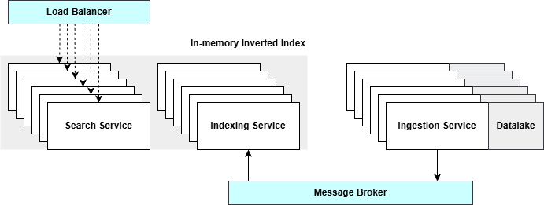

# Book Search Engine - Stage 3

[](https://go-skill-icons.vercel.app/api/) &nbsp; &nbsp; &nbsp;[](https://go-skill-icons.vercel.app/api/) &nbsp;[](https://go-skill-icons.vercel.app/api/) &nbsp;[](https://go-skill-icons.vercel.app/api/)

## 📑 Tabla de contenidos

- [✨ Descripción del proyecto](#-descripción-del-proyecto)
- [🧭 Contexto arquitectónico](#-contexto-arquitectónico)
- [🗺️ Diagrama de arquitectura](#️-diagrama-de-arquitectura)
- [🔧 Instrucciones de construcción y ejecución](#-instrucciones-de-construcción-y-ejecución)
- [📊 Benchmarking](#-benchmarking-pruebas-de-rendimiento)
- [🎥 Vídeo de demostración](#-vídeo-de-demostración)
- [👥 Autores](#-autores)


## ✨ Descripción del proyecto

Este proyecto implementa una **arquitectura de motor de búsqueda distribuida, tolerante a fallos y escalable horizontalmente**. El objetivo es proporcionar una plataforma completa de búsqueda capaz de manejar cargas de trabajo de ingestión, indexación y consulta a través de múltiples nodos cooperando entre sí.

El sistema está diseñado como un conjunto de servicios desplegados en múltiples nodos y contenedores. Soporta **ingestión paralela de documentos, indexación distribuida y búsquedas de baja latencia** bajo carga creciente, manteniéndose operativo ante fallos parciales. La escalabilidad y resiliencia se logran mediante replicación, comunicación asíncrona y compartición de datos en memoria.

Características arquitectónicas clave:

- **Ingestión distribuida (crawling)**: múltiples instancias descargan documentos en paralelo y los almacenan en un datalake replicado.
- **Indexación asíncrona** coordinada mediante un broker de mensajería, permitiendo procesar documentos de forma independiente y fiable.
- **Índice invertido distribuido en memoria**, implementado con Hazelcast, particionado y replicado en el clúster para consultas rápidas y tolerancia a fallos.
- **Capa de búsqueda balanceada por carga** usando Nginx, que distribuye peticiones entre instancias y maneja automáticamente caídas de nodos.

Todo el sistema es desplegado con **Docker Compose**, permitiendo ejecuciones reproducibles en cualquier entorno. Se incluyen experimentos de benchmarking e inyección de fallos para evaluar escalabilidad, rendimiento y recuperación.

## 🧭 Contexto arquitectónico

Este proyecto (Stage 3) evoluciona a partir del [**Stage 2**](https://github.com/ayozeruanoalc/stage_2), transformando una solución mononodo en un sistema verdaderamente distribuido y preparado para funcionar en clúster:

- **De mononodo a clúster distribuido**: Stage 2 era una solución mononodo, sin carácter distribuido real; Stage 3 está diseñada para ejecutarse en múltiples nodos cooperando entre sí, con escalabilidad horizontal y replicación de datos.
- **Tolerancia a fallos avanzada**: mientras que en Stage 2 la caída del nodo implicaba pérdida de servicio, Stage 3 combina Hazelcast y ActiveMQ para eliminar puntos únicos de fallo y permitir que el sistema siga respondiendo incluso ante la caída de uno o varios nodos.
- **Ingesta y procesamiento asíncrono más eficiente**: el pipeline de ingestión e indexación pasa a estar desacoplado y coordinado mediante mensajería, permitiendo que crawlers e indexers trabajen en paralelo de forma fiable.
- **Almacenamiento y consultas distribuidas**: en Stage 2 el índice invertido se mantenía localmente en MongoDB; en Stage 3 se reemplaza por un índice invertido en memoria distribuido y replicado mediante Hazelcast, garantizando búsquedas rápidas, consistentes y sin punto único de fallo.
- **Despliegue reproducible y portable**: todos los servicios se contenerizan y orquestan con Docker Compose, facilitando levantar el mismo clúster completo en cualquier entorno de pruebas o laboratorio.

## 🗺️ Diagrama de arquitectura



## 🔧 Instrucciones de Construcción y Ejecución

### 📌 Requisitos Previos

Asegúrate de que las siguientes herramientas estén instaladas en todos los nodos que participarán en el cluster:

- **Java JDK 17**<br>Verifica con:
  ```bash
  java -version
  ```

- **Apache Maven 3.6+**<br>Verifica con:
  ```bash
  mvn -v
  ```

- **Docker Desktop**

- `curl` (opcional, para comprobaciones rápidas de endpoints y estado)

### 🏗 Construcción

Todos los servicios se construyen a partir de un proyecto Maven multi-módulo. Antes de ejecutar el cluster por primera vez, compila y empaqueta todos los servicios ejecutando el siguiente comando **desde el directorio raíz del repositorio**:
```bash
mvn clean package
```
Este paso genera los archivos JAR ejecutables requeridos por cada microservicio. Las imágenes de Docker reutilizarán estos artefactos durante el inicio de los contenedores.

### ⚙ Configuración de Servicios (Docker Compose)

El sistema se despliega usando **Docker Compose** y se configura mediante variables de entorno definidas en el archivo `docker-compose.yml`. Cada servicio debe estar correctamente parametrizado para poder unirse al cluster en memoria de Hazelcast, descubrir otros miembros del cluster, conectarse al broker central de ActiveMQ si es necesario, etc.

Todos los marcadores `xxx` deben reemplazarse con la **dirección IP de la máquina donde se ejecuta el servicio** o, cuando se indique, con la IP del nodo del broker.

```yaml
ingestion-service:
  build:
    context: ./ingestion-service
  image: ingestion-service:latest
  container_name: ingestion-service
  ports:
    - "5701:5701"
  command: ['datalake']
  environment:
    HZ_PORT: "5701"
    HZ_PUBLIC_ADDRESS: xxx:5701
    HZ_MEMBERS: xxx:5701
    HAZELCAST_CLUSTER_NAME: SearchEngine
    BROKER_URL: tcp://xxx:61616
    REPLICATION_FACTOR: 2
    INDEXING_BUFFER_FACTOR: 2
  volumes:
    - ./mnt/datalake:/app/datalake
  networks:
    - search_net
  profiles:
    - backend

indexing-service:
  build:
    context: ./indexing-service
  image: indexing-service:latest
  container_name: indexing-service
  ports:
    - "5702:5702"
  command: ['datalake']
  environment:
    HZ_PORT: "5702"
    HZ_PUBLIC_ADDRESS: xxx:5702
    HZ_MEMBERS: xxx:5701
    HAZELCAST_CLUSTER_NAME: SearchEngine
    BROKER_URL: tcp://xxx:61616
  volumes:
    - ./mnt/datalake:/app/datalake
  networks:
    - search_net
  profiles:
    - backend

search-service:
  build:
    context: ./search-service
  image: search-service:latest
  container_name: search-service
  ports:
    - "5703:5703"
    - "7003:7003"
  environment:
    HZ_PORT: "5703"
    SERVICE_PORT: "7003"
    HZ_PUBLIC_ADDRESS: xxx:5703
    HZ_MEMBERS: xxx:5701
    HAZELCAST_CLUSTER_NAME: SearchEngine
    SORTING_CRITERIA: "frequency"
  networks:
    - search_net
  profiles:
    - backend
```

**Parámetros relevantes**:

- `HZ_PUBLIC_ADDRESS`: Dirección pública de este servicio, accesible por otros miembros de Hazelcast.
- `HZ_MEMBERS`: Nodo semilla (seed) usado para la formación inicial del clúster de Hazelcast.  
  Todos los nodos deben apuntar al mismo seed. En el primer nodo del sistema puede apuntar a sí mismo.
- `BROKER_URL`: Dirección del broker de ActiveMQ.
- `REPLICATION_FACTOR`: Número de réplicas en el datalake por documento.
- `INDEXING_BUFFER_FACTOR`: Controla el batching antes de publicar eventos de indexación.
- `SERVICE_PORT`: Puerto HTTP expuesto por la API de búsqueda.
- `SORTING_CRITERIA`: Estrategia de ordenación usada para los resultados de búsqueda (`frequency` | `id`).

> Nota: los puertos `5701`, `5702` y `5703` se utilizan para la comunicación interna del clúster Hazelcast entre nodos.  
> El puerto `7003` es el que expone la API HTTP de búsqueda hacia el exterior (y el que debe usar Nginx como backend).


### 🖥 Configuración del Balanceador de Carga (Nginx)

Antes de iniciar el balanceador de carga, el archivo `nginx.conf` debe actualizarse para incluir las direcciones IP de todos los nodos que ejecutan un servicio de búsqueda. Cada entrada de backend debe apuntar a un endpoint `<NODE_IP>:7003` accesible.
```nginx
upstream search_backend {
    least_conn;

    server <NODE_IP>:7003 max_fails=10 fail_timeout=30s;
    # server <NODE_IP>:7003 max_fails=10 fail_timeout=30s;

    keepalive 64;
}
```

Agrega o elimina líneas `server` a medida que se añaden o eliminan instancias de servicio de búsqueda. Nginx distribuirá automáticamente el tráfico y omitirá los nodos fallidos.

### 🚀 Perfiles y Arranque con Docker Compose

La ejecución de los servicios se controla mediante **perfiles de Docker Compose** permitiendo asignar diferentes roles a distintos nodos:

- `backend`: servicios de ingestión, indexación y búsqueda

- `broker`: broker de mensajes ActiveMQ

- `loadbalancer`: proxy inverso Nginx

Una vez que todos los valores de configuración estén correctamente establecidos, se puede iniciar el cluster.

#### Nodo Principal (Broker + Backend + Load Balancer)
```bash
docker compose --profile backend --profile broker --profile loadbalancer up -d
```

#### Nodos Adicionales (Solo Servicios Backend)
```bash
docker compose --profile backend up -d
```

Cada nodo se unirá automáticamente al clúster de Hazelcast y se conectará al broker usando los parámetros configurados.

Para añadir nuevos nodos y escalar horizontalmente:

- Ejecuta en la nueva máquina solo el perfil `backend`.
- Configura en ese nodo su propia IP en `HZ_PUBLIC_ADDRESS`.
- Mantén el mismo valor de `HZ_MEMBERS` apuntando al nodo semilla del clúster.

De esta forma, el nuevo nodo se integrará automáticamente en el clúster existente y comenzará a participar en la ingestión, indexación y búsqueda.

### 📝 Notas adicionales

- Docker Compose gestiona tanto la construcción de imágenes como la ejecución de contenedores; no se requiere un paso separado de `docker build`.
- Los servicios se pueden reiniciar de manera independiente sin pérdida de datos gracias a la replicación de Hazelcast y la coordinación mediante el broker.

## 📊 Benchmarking (Pruebas de Rendimiento)

### 📈 Resumen

Se ejecutó un conjunto de pruebas controladas (reproducibles mediante el servicio de benchmark incluido) para evaluar el **rendimiento, la escalabilidad y la tolerancia a fallos** del motor de búsqueda distribuido bajo diferentes cargas de trabajo. Los experimentos se centran en:

- Tasa de ingestión y rendimiento de indexación
- Latencia de consultas de búsqueda bajo carga concurrente
- Escalabilidad horizontal al agregar réplicas de servicios
- Tolerancia a fallos y tiempo de recuperación tras fallos simulados de nodos


### 🧪 Configuración del Servicio de Benchmark

```yaml
benchmark:
  environment:
    BENCHMARK_MODE: recoverytime
```

Modos de benchmark soportados:
- `ingestionrate`: documentos por segundo (docs/s)
- `indexingthroughput`: tokens por segundo (tokens/s)
- `recoverytime`: tiempo de recuperación del clúster tras fallos

### 🔁 Reproducción de los Benchmarks

1. Desplegar el sistema usando Docker Compose.
2. Poblar el datalake usando el servicio de ingestión.
3. Configurar `BENCHMARK_MODE` al experimento deseado.
4. Iniciar el servicio de benchmark:
```bash
docker compose --profile benchmark up -d
```
5. Escalar los servicios backend y repetir las pruebas según sea necesario.
6. Simular fallos deteniendo contenedores durante la ejecución.

### ⏱️ Benchmark de Latencia de Consultas (Apache JMeter)

La latencia de las consultas se midió usando **Apache JMeter**. Con el sistema en ejecución, ejecutar:

- `load-test.jmx` (ubicado en `/benchmarks`)

El directorio `/benchmarks` también contiene conjuntos de datos, registros y resultados de benchmarks anteriores.

## 🎥 Vídeo de Demostración

👉 [[Stage 3] Search Engine Project - GuancheData](https://youtu.be/RHMDEk85xtI)

El vídeo muestra el despliegue completo del clúster desde cero, la ingestión y búsqueda en tiempo real, la adición dinámica de nodos para escalar horizontalmente bajo carga y la recuperación automática del sistema tras la caída simulada de servicios.

## 👥 Autores

- **Fabio Nesta Arteaga** — 🔗 [GitHub](https://github.com/NestX10)
- **Pablo Cabeza** — 🔗 [GitHub](https://github.com/pabcablan)
- **Joel Ojeda** — 🔗 [GitHub](https://github.com/joelojeda)
- **Enrique Reina** — 🔗 [GitHub](https://github.com/ellupe)
- **Ayoze Ruano** — 🔗 [GitHub](https://github.com/ayozeruanoalc)


